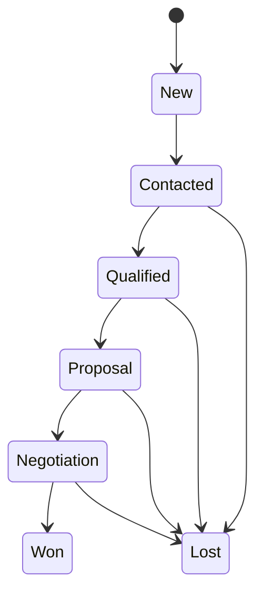

# WizCRM — Lead lifecycle

This document defines how WizCRM models a **lead** and the **stages** it passes through from first touch to customer (or closed-lost). Use it as the product reference when designing the database, UI, and APIs.

## Lead

A **lead** is a person or organization that may become a customer. At minimum, WizCRM should store:

| Field group | Examples |
|-------------|----------|
| Identity | Name, company, email, phone |
| Source | Website, referral, campaign, cold outreach, event |
| Ownership | Assigned user / team |
| Stage | Current lifecycle stage (see below) |
| Timestamps | Created, last activity, stage changed |
| Outcome | Open, won, lost (with reason when closed) |

Optional but valuable: industry, size, budget, expected close date, tags, custom fields.

## Lifecycle stages

Stages are **ordered** for reporting and pipeline views. A lead normally moves forward; moving backward (e.g. re-qualifying) should be allowed with an audit trail.

| Stage | Purpose | Typical actions |
|-------|---------|-----------------|
| **New** | Lead just entered the system | Assign owner, verify contact data |
| **Contacted** | First outreach attempted or completed | Log call/email, schedule follow-up |
| **Qualified** | Fit and interest confirmed (BANT or your criteria) | Document needs, estimate value |
| **Proposal** | Quote or proposal sent | Attach proposal, set follow-up date |
| **Negotiation** | Terms, pricing, or contract in discussion | Update deal value, note objections |
| **Won** | Deal closed successfully | Create account/customer record, hand off |
| **Lost** | No longer pursuing | Record loss reason for analytics |

You may add substages later (e.g. *Meeting scheduled* under Contacted) without changing the core model if each substage maps to one parent stage for reporting.

## Stage transitions

Recommended rules for implementation:

1. **Every stage change** records: previous stage, new stage, user, timestamp, optional note.
2. **Activities** (calls, emails, tasks) do not automatically change stage unless the user chooses “move to …” or automation is configured later.
3. **Won** and **Lost** are terminal for the *sales* pipeline; won leads may spawn an **Account** entity for post-sale CRM (renewals, support)—to be defined in a later doc.
4. **Reopen**: A lost lead may return to an earlier stage only with explicit action and audit log.

## Activities and timeline

Each lead should expose a **timeline** combining:

- Stage changes  
- Logged activities (type, subject, body, date, owner)  
- System events (assignment changed, duplicate merged)

Activity types to support in v1:

- Call  
- Email  
- Meeting  
- Task / reminder  
- Note (internal)

## Pipeline and reporting

- **Pipeline view**: Kanban or list grouped by stage, filterable by owner and source.  
- **Metrics** (future): conversion rate by stage, average time in stage, win/loss by source and reason.  
- **Stale leads**: Highlight leads with no activity in N days (configurable).

## Win / loss reasons

When closing as **Lost**, require or strongly encourage a reason, e.g.:

- Price  
- Timing / not ready  
- Chose competitor  
- No budget  
- Unresponsive  
- Not a fit  
- Other (free text)

When closing as **Won**, capture optional: contract value, start date, products/services.

## Permissions (outline)

To be refined with authentication design:

- **Sales user**: CRUD on own leads; read on team leads if enabled.  
- **Manager**: Full team pipeline, reassign leads, reports.  
- **Admin**: Stages, sources, users, system settings.

## Implementation checklist

Use this when building features:

- [ ] Lead CRUD with required fields and validation  
- [ ] Configurable stage list (admin) with default set above  
- [ ] Stage change API with history table  
- [ ] Activity log API and UI timeline  
- [ ] Pipeline UI by stage  
- [ ] Close as Won / Lost with reasons  
- [ ] Search and filter (stage, owner, source, date range)  
- [ ] Export (CSV) for reporting  

## Related

- [README.md](./README.md) — Project overview, repo, and Docker notes
