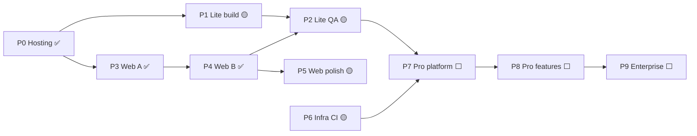

# WizCRM — Phase status (top-level)

Single view of **where the programme is by phase**. Task-level detail: [OUTSTANDING-TASKS.md](./OUTSTANDING-TASKS.md) · Full tracker: [PROGRESS_TRACKER.md](./PROGRESS_TRACKER.md)

**Last updated:** 2026-05-22

| Phase | Name | Status | Delivered / live today | Remaining to close phase |
|-------|------|--------|-------------------------|---------------------------|
| **P0** | **Production hosting** | ✅ **Done** | VPS (Contabo), `https://api.wizcrm.app`, `https://app.wizcrm.app`, Docker Postgres, Caddy TLS, deploy scripts, SSH git push | — |
| **P1** | **Lite mobile (build)** | 🟡 **In progress** | Lite+ Pro slice: edit lead, source/priority, call/WhatsApp, post-call return prompt, offline notes, insights, drafts, extended desk | Rebuild APK + **QA-LITE-PILOT** on device |
| **P2** | **Lite sign-off (quality)** | 🟡 **In progress** | Pilot script: [docs/MOBILE-PILOT.md](./docs/MOBILE-PILOT.md) | UT/QA/E2E rows after pilot pass |
| **P3** | **Web — Cluster A (admin)** | ✅ **Done** | Login, org, users, platform, connection, audit, `/admin` API | — |
| **P4** | **Web — Cluster B (manager)** | ✅ **Done** | Manager home, pipeline, leads table, reports/CSV | — |
| **P5** | **Web — polish** | 🟡 **In progress** | Teams **view** on web | **WEB-012** teams create/edit on web |
| **P6** | **Infrastructure & CI** | 🟡 **In progress** | API+DB live, test runners, OpenAI on server | **INF-007** CI, **INF-010** UT on push, close **INF-004/005/006**, **QA-INF-004** |
| **P7** | **Pro platform (Cluster C)** | ⬜ **Not started** | — | **INF-008** tenant schema, **PRO-014** multi-tenant, **PRO-015** + **SG-001–005** ScaleGate |
| **P8** | **Pro product features** | 🟡 **In progress** | **PRO-001/002/003/006/008** mobile+API slice (not full SaaS) | Remaining **PRO-004–013**, **QA-PRO-PILOT** |
| **P9** | **Enterprise** | ⬜ **Not started** | — | **ENT-001–012**, ERP connectors, **QA-ENT-PILOT** |
| **P10** | **Web — Cluster D (sales parity)** | ⏸ **Deferred** | — | **WEB-030–033** (full CRM in browser) |
| **P11** | **Business & compliance (MGT)** | 🟡 **In progress** | **MGT-020** DNS/hosting largely done (`wizcrm.app`) | Play/Apple accounts, ScaleGate contracts, ERP sandboxes, legal, store listings, support |

---

## Phase diagram

---

## Recommended focus (by phase)

| Order | Phase | Why now |
|-------|-------|---------|
| 1 | **P5** | Small win — finish **WEB-012** |
| 2 | **P2** | Unblocks “Lite complete” — pilot QA + remaining UT/E2E |
| 3 | **P6** | CI + INF closeout so P2 doesn’t regress |
| 4 | **P7 → P8** | Only when selling multi-customer SaaS |

---

## Status legend

| Symbol | Meaning |
|--------|---------|
| ✅ Done | Phase outcomes met; in production or signed off |
| 🟡 In progress | Substantially started; phase not closed |
| ⬜ Not started | Not begun |
| ⏸ Deferred | Explicitly later |

---

## Quick counts (open tasks in [OUTSTANDING-TASKS.md](./OUTSTANDING-TASKS.md))

| Phase bucket | Open rows (approx.) |
|--------------|---------------------|
| P2 Lite sign-off + P1 closeout | ~46 High priority |
| P5 + P6 | ~20 Medium |
| P7–P9 | ~38 Pro + Enterprise |
| P11 Business | 23 MGT |
| P10 Deferred | 4 WEB |

*Update this file when a **phase** closes (not every micro-task).*
