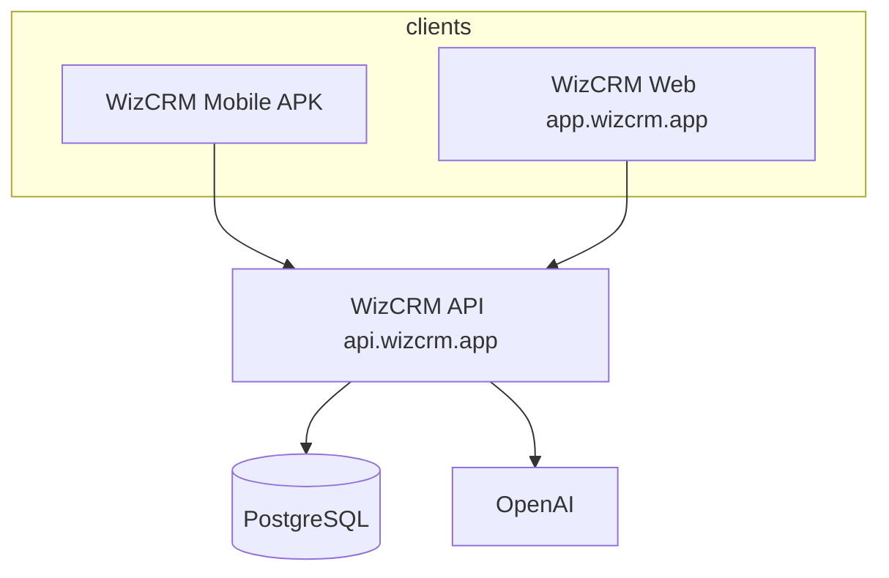

# WizCRM — Web application layer (supplement to SRS v2.2)

| Field | Value |
|-------|--------|
| **Status** | Draft — recommended next phase after Lite mobile + hosted API |
| **Parent** | [SRS.md](./SRS.md) §4 WizCRM Pro |
| **URL (target)** | `https://app.wizcrm.app` (A record → same VPS as API, or separate host) |
| **API** | Same backend as mobile: `https://api.wizcrm.app` |

---

## 1. Why add a web layer now

| Problem today | Web layer role |
|---------------|----------------|
| API URL / OpenAI / desk mode live only in server `.env` | **Settings UI** for admins (read-only secrets + toggles that map to env or DB) |
| No central user/team management UI | **Admin console** (PRO-013) |
| Managers use phone for team views | **Manager dashboard** on large screen (PRO-009) |
| Reps work in the field | **Mobile stays primary** for capture, calls, voice, cards |

**Principle:** Web is **control plane + manager desk** first; **full sales CRM in browser** second (optional parity with mobile).

---

## 2. Positioning by tier

| Tier | Web scope (phased) |
|------|---------------------|
| **Lite (now)** | Single-org **admin settings** + health; optional read-only pipeline for managers |
| **Pro** | Multi-tenant admin, branding, targets, quotes (web), CSV export, ScaleGate status |
| **Enterprise** | SSO, integrations, ERP connector config |

Lite mobile requirements are unchanged; web does **not** replace LITE-014 mobile-first delivery.

---

## 3. Architecture



| Layer | Choice (recommended) |
|-------|----------------------|
| Web framework | **React + Vite** (or Next.js if SSR/marketing later) |
| Shared logic | `@wizcrm/shared` (Zod schemas, stages, roles) |
| Auth | Same JWT as mobile (`POST /auth/login`, Bearer token) |
| Hosting | Caddy: `app.wizcrm.app` → static build or Node SSR; API unchanged |
| Settings storage | Phase 1: org/user rows in Postgres; Phase 2: `Organization.settings` JSON for toggles |

---

## 4. Web requirements (`WEB-*`)

### 4.1 Foundation (build first)

| ID | Requirement | Acceptance |
|----|-------------|------------|
| **WEB-001** | **Scaffold** — `web/` app builds and deploys to `app.wizcrm.app` | `npm run build -w web` produces assets; login page loads over HTTPS |
| **WEB-002** | **Auth** — email/password login, JWT in httpOnly cookie or secure storage | Same users as mobile; role from token; logout |
| **WEB-003** | **App shell** — sidebar/top nav, role-based menu | Sales sees reduced menu; Manager + Admin see settings |
| **WEB-004** | **API client** — configurable base URL (build-time `VITE_API_URL`) | All calls to `https://api.wizcrm.app`; 401 → login |

**Infrastructure:** `INF-006` Web app scaffold (see [PROGRESS_TRACKER.md](./PROGRESS_TRACKER.md)).

### 4.2 Admin & central settings (priority — user-requested)

| ID | Requirement | Acceptance |
|----|-------------|------------|
| **WEB-010** | **Organization profile** — name, timezone (single org Lite; tenant slug Pro) | Admin can view/edit; saved via API |
| **WEB-011** | **Users** — list, invite, deactivate, role (Sales / Manager / Admin) | Implements slice of **PRO-013** |
| **WEB-012** | **Teams** — create/rename, assign members | Manager+ ; aligns with mobile team tab |
| **WEB-013** | **AI & platform settings** — show `aiEnabled`, desk mode (rules vs LLM), model name (read-only), link to docs | Toggles call `PATCH /admin/settings` (new API) or documented env restart for secrets |
| **WEB-014** | **Connection info** — display public API URL, mobile APK hint, health check status | No secrets shown; “copy API URL for mobile” |
| **WEB-015** | **Audit tail** — last 20 AI suggest/approve events (read-only) | Supports **NFR-003** |

**Does not include:** editing `OPENAI_API_KEY` in browser (server/env only for security).

### 4.3 Manager workspace (second wave)

| ID | Requirement | Acceptance |
|----|-------------|------------|
| **WEB-020** | **Manager home** — team stats summary | Slice of **PRO-009** |
| **WEB-021** | **Pipeline board** — Kanban by stage, filter by team/owner | Read/write same as mobile pipeline |
| **WEB-022** | **Leads table** — search, filter, open lead drawer | Faster than phone for bulk review |
| **WEB-023** | **Reports** — conversion by stage/source, CSV export | **PRO-012** |

### 4.4 Sales CRM parity (defer)

| ID | Requirement | Notes |
|----|-------------|--------|
| **WEB-030** | Desk view (full AI desk) | Optional; mobile sufficient for Lite |
| **WEB-031** | Lead detail + AI panels | Defer until admin stable |
| **WEB-032** | Quotes UI | **PRO-011** |
| **WEB-033** | Communication drafts | **PRO-005/006** |

---

## 5. API additions (backend cluster `API-WEB-*`)

Needed to support settings (can ship with web foundation):

| ID | Requirement |
|----|-------------|
| **API-WEB-001** | `GET/PATCH /admin/organization` — profile + settings JSON |
| **API-WEB-002** | `GET/POST/PATCH /admin/users` — user CRUD (Admin only) |
| **API-WEB-003** | `GET/PATCH /admin/settings` — desk AI mode, feature flags (maps to env until DB-backed) |
| **API-WEB-004** | `GET /admin/health` — extends public health with version, db, ai flags |

*Existing routes (`/teams`, `/leads`, …) reused by web where possible.*

---

## 6. Recommended implementation order (task clusters)

### Cluster A — **Web foundation + settings** (recommended next)

**Goal:** Central place for admin configuration; unblocks ops without another APK rebuild.

| Order | IDs | Est. |
|-------|-----|------|
| 1 | INF-006, WEB-001, WEB-002, WEB-003, WEB-004 | ~3–5 days |
| 2 | API-WEB-001..004 (minimal) | ~2–3 days |
| 3 | WEB-010..WEB-015 | ~4–6 days |

**Outcome:** `app.wizcrm.app` → login as admin → users, teams, AI desk toggle, health.

### Cluster B — **Manager workspace**

| IDs | WEB-020..WEB-023, PRO-009, PRO-012 (web) |
| **After** Cluster A |

### Cluster C — **Pro platform**

| IDs | PRO-014 multi-tenant, PRO-015 ScaleGate, INF-008 |
| **Before** external SaaS customers |

### Cluster D — **Sales parity on web**

| IDs | WEB-030..WEB-033, PRO-001..008 on web |
| **Defer** unless customers demand desktop selling |

---

## 7. DNS / hosting (manager)

| Host | Purpose |
|------|---------|
| `api.wizcrm.app` | API (existing) |
| `app.wizcrm.app` | Web app (new A record → same VPS IP) |

Caddy example:

```text
app.wizcrm.app {
    root * /var/www/wizcrm-web
    file_server
    try_files {path} /index.html
}
```

---

## 8. Traceability

| SRS (main) | Web supplement |
|------------|----------------|
| PRO-013 Admin | WEB-011, WEB-012, WEB-010 |
| PRO-014 Platform web + mobile | WEB-001..004, INF-006 |
| PRO-009 Manager Cockpit | WEB-020..WEB-022 |
| PRO-012 Reporting | WEB-023 |
| LITE-014 minimal web optional | WEB-010..015 only (admin), not full CRM |

---

## 9. Out of scope (web v1)

- Replacing mobile for reps in the field  
- Editing server secrets in UI  
- Multi-tenant signup billing (ScaleGate UI) — Cluster C  
- Full quote/ERP UI — Pro/Enterprise later  

---

## Related

- [SRS.md](./SRS.md)  
- [PROGRESS_TRACKER.md](./PROGRESS_TRACKER.md) — add `WEB-*` rows when work starts  
- [manager_tasks.md](./manager_tasks.md) — MGT-020 domain (`app.wizcrm.app`)
