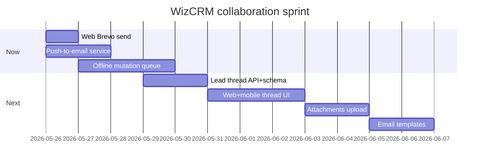

# Development plan: notifications, offline, email, team chat

**Date:** 2026-05-26  
**Scope:** P2-FLD-001/002, TOOL-005 (email path), Brevo lead email, FR-NTH-010/011/020 (collaboration)

---

## Executive summary

| Area | Strategy | Effort (eng days) |
|------|----------|-------------------|
| **Push (mobile)** | Keep **local/reminder** only (`expo-notifications`) — no FCM/APNs infra | Done (MOB-GAP-208) |
| **Push-to-email** | Brevo transactional emails for @mentions, task/lead events | 2–3 |
| **Offline mobile** | Unified **mutation queue** + read caches; not full CRDT sync | 3–5 |
| **Email (Brevo)** | API + mobile send exist; **web send** + templates next | 1–2 |
| **Team chat** | **Custom lead thread** on Postgres (recommended); not Stream/Sendbird | 5–8 |

---

## 1. Push notifications

### 1.1 What we will NOT build (Phase 2)

- FCM/APNs device registration, server push gateway, notification inbox service
- Background geofence push, marketing campaigns
- SRS `TOOL-005` full stack → defer to Pro+ when pilot demands it

### 1.2 What we keep (mobile)

Already in `mobile/lib/notifications.ts`:

- Android notification channel
- Reschedule on desk refresh: tasks due today, calendar events ~1h before
- Permission prompt on first use

**Acceptance:** Rep gets on-device banners without backend push infra.

### 1.3 Push-to-email (implement now)

**Goal:** When the app cannot reach the user on-device, email is the reliable “push.”

| Event | Recipient | Template |
|-------|-----------|----------|
| `@mention` in lead thread | Mentioned user(s) | “{actor} mentioned you on {lead}” + deep link |
| Task created with `assigneeUserId` ≠ actor | Assignee | Task title, due date, lead link |
| Lead owner changed | New owner | Handoff summary |
| Optional digest | Manager | Stale leads (later) |

**Implementation:**

- `api/src/services/notification-email.service.ts` — wraps `sendTransactionalEmail`, builds HTML with `APP_URL` deep link (`/leads?open={leadId}`)
- Fire-and-forget from domain hooks (do not block HTTP on Brevo latency)
- `GET /email/status` already exists; failures log only if Brevo missing

**Not in v1:** per-user DND (`FR-NTH-053`), digest cron (use reports page).

---

## 2. Offline mobile (priority)

### 2.1 Current state

| Capability | File | Status |
|------------|------|--------|
| Lead list cache | `offline-leads-cache.ts` | ✅ |
| Lead detail cache | same | ✅ |
| Offline notes queue | `offline-notes.ts` | ✅ |
| Sync UI | `lead/[id].tsx` | ✅ “Sync now” |

### 2.2 Target architecture

```
┌─────────────────┐     online      ┌──────────────┐
│  Mobile UI      │ ───────────────► │  WizCRM API  │
└────────┬────────┘                  └──────────────┘
         │ offline
         ▼
┌─────────────────┐
│ offline-queue   │  FIFO mutations (id, type, payload, createdAt)
│ + lead caches   │
└─────────────────┘
```

**Queued mutation types (v1):**

| Type | API replay |
|------|------------|
| `NOTE` | `POST /leads/:id/activities` |
| `ACTIVITY` | `POST /leads/:id/activities` (CALL/EMAIL/MEETING) |
| `LEAD_PATCH` | `PATCH /leads/:id` |
| `TASK_CREATE` | `POST /tasks` |
| `STAGE_CHANGE` | `PATCH /leads/:id` with `stage` |

**Explicitly out of scope (v1):** quotation/opportunity offline, pipeline rank, bulk assign, AI calls while offline.

### 2.3 UX rules

- Show banner: “Offline — changes will sync when connected”
- `flushOfflineQueue()` on: app foreground, pull-to-refresh, “Sync now”, after successful login
- Conflict policy: **last-write-wins** on replay; server wins on 409 (show toast, drop or keep in queue per type)
- Migrate existing `offline-notes.json` into unified queue on first read

### 2.4 Acceptance (P2-FLD-002)

- Rep can add note, log call, edit phone/stage, create task offline on lead detail
- List/detail readable from cache when API unreachable
- Single sync control drains queue with success/fail counts

---

## 3. Email integration (Brevo)

### 3.1 Already shipped

| Piece | Location |
|-------|----------|
| Secrets loader | `api/src/services/brevo-config.ts` |
| Send (API → SMTP fallback) | `api/src/services/brevo-mail.ts` |
| Lead send | `POST /email/leads/:leadId/send` |
| Health | `GET /health` → `emailConfigured` |
| Mobile | Lead detail → draft → **Send email (Brevo)** |
| Docs | `docs/email-integration.md` |

### 3.2 Gaps to close (this sprint)

| Gap | Action |
|-----|--------|
| Web only `mailto:` | Add **Send via Brevo** in `CommunicationDraftPanel` (parity with mobile) |
| Email templates `FR-NTH-030` | Org settings: named templates with `{{name}}`, `{{company}}` — phase 2b |
| Inbound sync `ENT-006` | Not in scope; log manual EMAIL activities only |

### 3.3 Deploy checklist

1. `docs/brevo.local.txt` on VPS (`/opt/wizcrm/docs/brevo.local.txt`)
2. `npm run email:validate -w api`
3. Verify `GET https://api.wizcrm.app/email/status`

---

## 4. Team chat, @mentions, attachments

### 4.1 Product requirements (SRS)

- **FR-NTH-011:** Internal thread per lead (not SMS to customer)
- **FR-NTH-010:** @mention → notify user + deep link
- **FR-NTH-020:** PDF/images on lead with size limits

### 4.2 Package research (readymade team chat)

| Vendor | Expo RN | React web | Lead-scoped thread | @mentions | Attachments | Cost @ ~50 users | Verdict |
|--------|---------|-----------|-------------------|-------------|-------------|------------------|---------|
| **Stream Chat** | `stream-chat-expo` (New Arch) | `stream-chat-react` | Custom channels per lead | Built-in | Built-in | Free tier 1k MAU; paid ~$399/mo | Overkill; 2 SDKs + sync service |
| **Sendbird** | Yes | UIKit | Custom channels | Built-in | Built-in | Higher $ at scale | Same as Stream |
| **CometChat** | Yes | Widget/UI kit | Custom | Built-in | Built-in | ~$299/mo | Same; on-prem only win for strict compliance |
| **Rocket.Chat embed** | Web iframe | iframe | Possible | Yes | Yes | Self-host ops burden | Poor mobile-native UX |
| **Custom (Prisma)** | REST + FlatList | React components | Native fit | Parse + email notify | Base64/disk upload | $0 marginal | **Recommended** |

**Recommendation: build custom lead thread** on existing stack.

**Why not Stream/Sendbird for WizCRM:**

1. Chat is **per-lead internal**, not a general social graph — CRM already has `Activity`, `User`, `Lead`.
2. **Data residency:** customer lead messages stay in your Postgres; no third-party message store.
3. **Cost:** 20–100 seat CRM stays on Brevo + Postgres vs $300–500+/mo chat MAU.
4. **Mobile:** Expo 54 + Stream v9 requires New Architecture and heavy peer deps; WizCRM mobile is intentionally lean.
5. **Timeline:** MVP thread + mentions + small attachments in **~1 week** vs **2+ weeks** integrating dual SDKs + token backend.

**When to reconsider SaaS chat:** Enterprise tier needs HIPAA chat archive, moderation AI, or 10k+ concurrent connections.

### 4.3 Custom data model

```prisma
model LeadMessage {
  id               String   @id @default(uuid())
  leadId           String
  userId           String
  body             String
  mentionedUserIds String[] @default([])
  createdAt        DateTime @default(now())
  attachments      LeadAttachment[]
}

model LeadAttachment {
  id        String   @id @default(uuid())
  leadId    String
  messageId String?
  userId    String
  fileName  String
  mimeType  String
  sizeBytes Int
  storagePath String  // disk under UPLOAD_DIR
  createdAt DateTime @default(now())
}
```

### 4.4 API surface

| Method | Path | Purpose |
|--------|------|---------|
| GET | `/leads/:id/messages` | Paginated thread |
| POST | `/leads/:id/messages` | Post message; parse mentions; email notify |
| GET | `/leads/:id/attachments` | List files |
| POST | `/leads/:id/attachments` | Upload (multipart or base64 ≤5MB) |
| GET | `/leads/:id/attachments/:aid` | Download |

### 4.5 Mention format

- Composer inserts `@[Display Name](userId)` (stable)
- Server regex extracts UUIDs; fallback match `@email` / first token of `@name`
- On create: `notifyMentionedUsers()` → Brevo email + future in-app feed

### 4.6 UI delivery phases

| Phase | Web | Mobile |
|-------|-----|--------|
| **A** | `LeadTeamChat` panel in drawer | Thread tab on `lead/[id]` |
| **B** | @ autocomplete from org users | Same |
| **C** | Attach file button | `expo-document-picker` + upload |
| **D** | Activity feed merges thread highlights | Push-to-email only |

---

## 5. Suggested sprint order



| Sprint | Deliverables | Tracker IDs |
|--------|--------------|-------------|
| **S1 (now)** | Web Brevo, push-to-email, offline queue v2 | P2-FLD-002, email gap |
| **S2** | Lead messages + mentions + email notify | FR-NTH-010/011 |
| **S3** | Attachments + download auth | FR-NTH-020 |
| **S4** | Email templates in CRM settings | FR-NTH-030 |

---

## 6. Risks and mitigations

| Risk | Mitigation |
|------|------------|
| Brevo rate limits on mention storms | Debounce: max 1 email per user per lead per 15 min |
| Large attachments fill disk | 5MB cap; `UPLOAD_DIR` on VPS with logrotate |
| Offline conflict on stage | Show server stage after sync; optional refresh |
| Stream temptation mid-sprint | Stick to custom unless Enterprise deal requires compliance package |

---

## 7. References

- [WEB-MOBILE-GAP-ANALYSIS.md](./WEB-MOBILE-GAP-ANALYSIS.md) — Brevo web gap, offline
- [email-integration.md](./email-integration.md) — Brevo setup
- [SRS.md](../SRS.md) — FR-NTH-010/011/020, PRO-005, TOOL-005
- Stream Expo tutorial: https://getstream.io/chat/sdk/react-native/tutorial/expo/
- Build vs buy: https://getstream.io/blog/build-vs-buy-chat/
