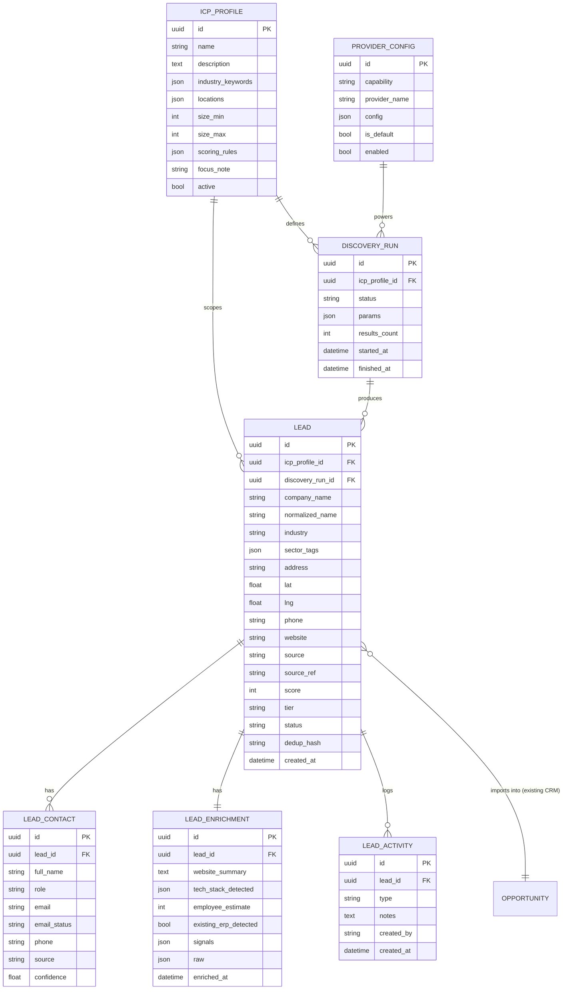

# Lead Engine — Claude Code Implementation Brief

**Purpose:** Add an in-app lead-generation engine to my personal CRM so I can discover, qualify, enrich, and import B2B leads (starting with Sage Evolution 200 ERP prospects in Nairobi) without ever leaving the CRM.

**Owner:** Paramjeet Singh Bhambra — Skillmind Software Ltd
**Document type:** Work order for Claude Code. Read this whole file before writing code.

## 0. How to use this brief (instructions to Claude Code)

1. **Do not start coding until Section 1 (Config) is filled in and you have completed Section 2 (Recon).** Confirm my stack against what's actually in the repo before assuming anything.
2. Work on a feature branch: `feature/lead-engine`. Never commit directly to main.
3. **No hardcoded secrets.** All API keys, endpoints, and provider toggles go in `.env` / the CRM's existing settings mechanism. Add a `.env.example` with every new variable.
4. Deliver **complete, unified files** — never partial snippets or "add this somewhere" fragments. Every file you write should be runnable as-is.
5. Build behind a **provider abstraction** (Section 6) so the default implementation is free/open-source and paid sources can be swapped in later via config, with zero changes to business logic.
6. Write tests for every service. Discovery and enrichment must have unit tests with mocked provider responses (do not hit live APIs in tests).
7. Respect the compliance rules in Section 10 as hard requirements, not suggestions. We operate under the **Kenya Data Protection Act 2019**.
8. Proceed phase by phase (Section 4). At the end of each phase, stop and report what was built, the acceptance criteria met, and anything that needs my decision.
9. If a raw **SQL Server** script is needed, wrap reserved keywords in square brackets, e.g. `[Status]`, `[LineNo]`. If the CRM is on Postgres/MySQL, ignore this.

## 1. Config — fill this in before issuing to Claude Code

```text
CRM_REPO_PATH      = <e.g. C:\projects\my-crm>
BACKEND_STACK      = <Django REST | .NET (C#) | Node/Express | other>
FRONTEND_STACK     = <React | Blazor | other>
DATABASE           = <PostgreSQL | SQL Server | MySQL | SQLite>
AUTH_MODEL         = <how existing CRM users/auth work — JWT, session, etc.>
EXISTING_LEAD_TABLE= <name of any current leads/contacts/opportunities tables, or "none">
MODULE_LOCATION    = <where new backend module should live, e.g. apps/leadengine>
DEPLOY_TARGET      = <Azure App Service | local | other>
```

If any field is left blank, **ask me once, then proceed** — do not silently guess on stack or database.

## 2. Recon (Phase 0 — do this first, write no feature code yet)

1. Map the repo: backend framework, ORM, migration tool, frontend framework, routing, state management, existing auth and API conventions.
2. Identify existing lead/contact/opportunity/pipeline tables and how a "deal" or "opportunity" is currently created. The new engine must **feed the existing pipeline**, not create a parallel one.
3. Identify the existing background-job mechanism (Celery, Hangfire, BackgroundService, cron). Enrichment is slow and must run async.
4. Produce a short `RECON.md` summarizing the above and confirming the data-model and API plan in Sections 5 and 7 fit the codebase. Flag any mismatch before continuing.

## 3. What we're building (scope)

Four capabilities, exposed in the CRM UI and API:

1. **Discovery** — given an ICP (industry keywords × locations), find matching companies from public sources and return candidates with name, sector, address, phone, website, geo.
2. **Qualification / Scoring** — score each candidate against the active ICP and assign a tier (A/B/C) so I work the best fits first.
3. **Enrichment** — for selected leads, fetch the company website and public sources to attach a decision-maker (Finance/IT/MD), email (guessed + verified), and signals (size estimate, existing-ERP detection).
4. **Import** — one click to push a qualified, enriched lead into the existing CRM pipeline as an opportunity, with provenance preserved.

Out of scope for v1: automated outbound sending, email sequencing, LinkedIn automation. (Draft-message generation is a stretch goal in Phase 6.)

## 4. Phased delivery plan

| Phase | Deliverable | Acceptance criteria |
|-------|-------------|---------------------|
| 0 Recon | `RECON.md`, confirmed plan | Stack, DB, pipeline model, job runner all documented; plan reconciled |
| 1 Foundation | Data model + migrations + provider abstraction + config | Tables migrate cleanly; `provider_config` seeded with free defaults; ICP seed loads |
| 2 Discovery | Discovery service + `/discover` endpoint + default Places/search provider | Running the Sage Evolution ICP returns ≥15 Nairobi candidates with phone+geo, deduped |
| 3 Scoring | Scoring service + tier assignment | Candidates from Phase 2 receive scores and A/B/C tiers per the Section 8 rubric; reproducible |
| 4 Enrichment | Enrichment service (async) + `/enrich` endpoint | Enriching a Tier-A lead attaches ≥1 contact attempt + size estimate + ERP-detection flag; provenance stored |
| 5 UI | Find Leads page, results grid, lead detail drawer, ICP manager | I can run a search, see tiered results, enrich, and view a lead end-to-end in the browser |
| 6 Pipeline | Import-to-pipeline + (stretch) draft outreach | Importing a lead creates a real opportunity linked to the lead; no duplicate opportunities |
| 7 Hardening | Compliance guardrails, rate limits, caching, suppression list, tests | All Section 10 rules enforced; test suite green; `.env.example` complete |

## 5. Data model

ORM-agnostic — implement with the CRM's existing ORM and migration tool. Names are guidance; match local conventions.



Notes:
- `status` on LEAD: `new → qualified → enriched → imported → rejected`.
- `dedup_hash` = hash of `normalized_name + locality + phone`. Enforce uniqueness; on collision, merge sources rather than insert.
- `email_status`: `guessed | valid | invalid | unverified | catch_all`.
- LEAD links to the **existing** opportunity/deal table — do not create a new pipeline table.

## 6. Provider abstraction (the key design constraint)

Every external capability sits behind an interface with a free/open-source default and a config-selectable alternative. Business logic depends only on the interface. This lets me run the PoC at zero cost and later swap in a paid source by changing `provider_config` — no code change.

Define four capabilities: `discovery`, `web_search`, `enrichment`, `email_verify`. Example interface (adapt language to the stack — Python shown):

```python
from abc import ABC, abstractmethod
from dataclasses import dataclass, field


@dataclass
class CompanyCandidate:
    name: str
    industry: str | None = None
    sector_tags: list[str] = field(default_factory=list)
    address: str | None = None
    lat: float | None = None
    lng: float | None = None
    phone: str | None = None
    website: str | None = None
    source: str = ""
    source_ref: str = ""
    raw: dict = field(default_factory=dict)


class DiscoveryProvider(ABC):
    """Find companies matching industry keywords within given locations."""

    name: str = "base"

    @abstractmethod
    def search(
        self,
        industry_keywords: list[str],
        locations: list[str],
        max_per_query: int = 10,
    ) -> list[CompanyCandidate]:
        ...


class EnrichmentProvider(ABC):
    """Given a company website/name, return contacts and signals."""

    name: str = "base"

    @abstractmethod
    def enrich(self, candidate: CompanyCandidate) -> dict:
        """Return {contacts: [...], employee_estimate, existing_erp_detected, signals, raw}."""
        ...
```

Default providers to implement first (all free / open-source):

| Capability | Default provider | Notes |
|-----------|------------------|-------|
| discovery | Google Places API (Text Search) | Free monthly credit; abstract so an OSS Google-Maps scraper or Scrap.io MCP can replace it |
| web_search | SearXNG (self-host) or SerpAPI free tier | Used for context, registry lookups, ERP-signal checks |
| enrichment | Crawl4AI or Playwright + BeautifulSoup | Crawl company site `/about`, `/team`, `/contact`; respect robots.txt |
| email_verify | OSS email permutation + MX/SMTP check | Optional Hunter.io free tier (25/mo) as a swappable upgrade |

Kenya-specific sources the discovery and enrichment providers should also tap (public data):
- Google Maps / Places listings
- Kenya Association of Manufacturers (KAM) member directory
- Yellow Pages Kenya / BizPages
- BRS / eCitizen business registry (existence verification only)
- The company's own website

## 7. API surface

Match the CRM's existing API conventions (auth, response envelope, pagination). Endpoints needed:

| Method | Path | Purpose |
|--------|------|---------|
| GET/POST/PUT/DELETE | `/api/leadengine/icp-profiles` | CRUD ICP profiles |
| POST | `/api/leadengine/discover` | Body `{icp_profile_id}`; runs discovery; returns `run_id` + candidates (async-friendly) |
| GET | `/api/leadengine/runs/{id}` | Run status + results |
| GET | `/api/leadengine/leads` | List/filter by `tier`, `status`, `icp_profile_id`, search |
| GET | `/api/leadengine/leads/{id}` | Lead detail + contacts + enrichment + activity |
| POST | `/api/leadengine/leads/{id}/enrich` | Queue enrichment (async) |
| POST | `/api/leadengine/leads/{id}/import` | Create opportunity in existing pipeline |
| POST | `/api/leadengine/leads/bulk-import` | Batch import selected leads |
| POST | `/api/leadengine/suppression` | Add a company/domain to the do-not-contact list |

Discovery and enrichment must run as background jobs and report progress; the UI polls run status. Do not block HTTP requests on long crawls.

## 8. Scoring rubric (Sage Evolution 200 ICP)

Store as `scoring_rules` JSON on the ICP profile so it's editable without code changes. Default rubric:

| Signal | Points |
|--------|--------|
| Manufacturing with BOM / production costing | +30 |
| Multi-warehouse or multi-branch distribution | +25 |
| Batch / expiry / serial tracking need (pharma, food, chemical) | +20 |
| SKU-heavy inventory (auto parts, hardware, FMCG) | +15 |
| Mid-market size signal (staff estimate or review-count proxy in band) | +15 |
| Outgrowing entry accounting (Pastel / QuickBooks / Sage 50 signal) | +10 |
| Enterprise-scale / likely existing tier-1 ERP (SAP, Oracle, X3) | −30 |
| Micro business / no real inventory complexity | −20 |

Tier thresholds: **A ≥ 60, B 35–59, C 15–34, drop < 15.** Tier and score must be reproducible and stored on the lead. Show the contributing signals in the lead detail so I can see *why* something scored as it did.

## 9. Seed ICP — load this so the first run works immediately

Insert as the first `ICP_PROFILE` record:

```json
{
  "name": "Sage Evolution 200 — Nairobi Mid-Market",
  "description": "Mid-market Nairobi firms (~30-500 staff) with multi-warehouse inventory, batch/BOM or SKU-heavy operations, likely outgrowing Pastel/QuickBooks.",
  "industry_keywords": [
    "wholesale distribution",
    "FMCG distributor",
    "manufacturing",
    "food and beverage manufacturer",
    "packaging manufacturer",
    "chemical manufacturer",
    "pharmaceutical manufacturer",
    "pharmaceutical distributor",
    "building materials supplier",
    "hardware wholesaler",
    "automotive parts distributor",
    "steel and metal fabrication"
  ],
  "locations": [
    "Nairobi Industrial Area",
    "Nairobi CBD",
    "Baba Dogo Nairobi",
    "Enterprise Road Nairobi",
    "Mombasa Road Nairobi",
    "Ruaraka Nairobi",
    "Embakasi Nairobi",
    "Athi River"
  ],
  "size_min": 30,
  "size_max": 500,
  "focus_note": "Lead with inventory, BOM, batch/expiry and multi-warehouse pain. De-prioritise firms large enough to already run SAP/Sage X3/Oracle.",
  "active": true,
  "scoring_rules": {
    "manufacturing_bom": 30,
    "multi_warehouse_distribution": 25,
    "batch_expiry_tracking": 20,
    "sku_heavy_inventory": 15,
    "midmarket_size_signal": 15,
    "outgrowing_entry_accounting": 10,
    "enterprise_existing_erp": -30,
    "micro_no_inventory": -20,
    "tier_thresholds": { "A": 60, "B": 35, "C": 15 }
  }
}
```

## 10. Compliance and safety (hard requirements)

1. **Public data only.** Company websites, Google Maps, public directories, business registries. No purchase of scraped personal databases.
2. **No LinkedIn scraping.** It breaches their ToS and risks bans. If LinkedIn data is ever wanted, use an official OAuth API path only. For v1, skip LinkedIn entirely.
3. **Respect robots.txt** and apply a per-domain rate limit (default 1 request / 2s) with a descriptive User-Agent. Cache fetched pages to avoid re-hitting sources.
4. **Kenya Data Protection Act 2019:** store only business-context contact data, record the **source and timestamp** (provenance) for every datapoint, and support deletion of any lead/contact on request.
5. **Suppression list:** before discovery or import, exclude any company/domain on the do-not-contact list. Make it easy to add to.
6. **No secrets in code or logs.** Sanitize provider errors so keys never appear in logs.
7. Email guessing is allowed (pattern + verify), but mark confidence and never present a guessed email as confirmed.

## 11. UI requirements (Phase 5)

1. **Find Leads page:** pick an ICP profile (or a quick form: industries multiselect + locations multiselect + size band) → **Run**. Show progress, then a results grid with columns: Company, Sector, Tier badge (A/B/C), Score, Phone, Website, checkbox.
2. Bulk actions on selected rows: **Enrich**, **Add to pipeline**, **Suppress**.
3. **Lead detail drawer:** company info + map pin (lat/lng), score breakdown (which signals fired), enrichment panel (size estimate, ERP-detected flag, website summary), contacts list with email status, and an activity log. Buttons: Add contact, Enrich, Import to pipeline.
4. **ICP manager:** create/edit ICP profiles including the scoring rules, so I can spin up new target profiles (e.g. "CloudHR — Nairobi SMEs", "WizPMS — Coastal hotels") without code.

## 12. Definition of done

1. From the CRM UI I can load the seed ICP, run discovery, and get ≥15 tiered Nairobi candidates with phone + geo, deduped.
2. I can enrich a Tier-A lead and see at least one decision-maker contact attempt, a size estimate, and an ERP-detection flag, each with a source.
3. I can import a qualified lead into the existing pipeline as an opportunity with no duplicates.
4. All providers run on free/open-source defaults; swapping to a paid source is a `provider_config` change only.
5. Compliance rules in Section 10 are enforced; tests pass; `.env.example` documents every new variable; a short `LEADENGINE.md` explains how to run it.

## 13. First command to run after build

Paste this to Claude Code once Phase 5 is complete:

> Load the "Sage Evolution 200 — Nairobi Mid-Market" ICP, run a discovery pass, score and tier the results, then enrich the Tier-A leads and show me the table sorted by score. Do not import anything yet.
