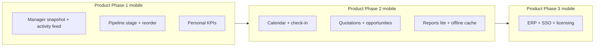

# Web ↔ Mobile feature gap analysis

**Purpose:** Compare what reps and managers can do on **app.wizcrm.app** (web) vs the **Android/iOS app** (Expo APK), and schedule **missing mobile work** by product phase.

**Sources:** [PROGRESS_TRACKER.md](../PROGRESS_TRACKER.md), [WizCRM_Development_Phases.md](../WizCRM_Development_Phases.md), route/code review (2026-05-27).

**Legend:** ✅ Parity · 🟡 Partial · ⬜ Web only · 📱 Mobile only

---

## Executive summary

| | Web | Mobile |
|---|-----|--------|
| **Primary user** | Managers + admins (console); reps can use home/leads | Field reps + managers on the go |
| **Strength** | Full workspace: pipeline UX, reports, admin, calendar, opportunities, quotations | Calls, GPS/maps, offline notes, card scan, AI desk, post-call flow |
| **Phase 1 core CRM** | ~92% (web) | ~85% for **rep daily use**; **manager oversight** much lower on mobile |
| **Phase 2** | Kickoff live (reports, webhook admin, quotations, calendar check-in) | Only **offline sync button** + API-backed logging; no calendar/quotations UI |

**Bottom line:** Mobile matches web well for **lead capture, contact, close, log activity, and timeline**. Gaps cluster in **manager dashboards**, **pipeline operations**, **calendar/field attendance**, and **Phase 2 commercial objects** (quotations, opportunities).

---

## Parity matrix

### Authentication & platform

| Feature | Web | Mobile | Notes |
|---------|-----|--------|-------|
| JWT login | ✅ | ✅ | |
| Role-based UI (sales / manager / admin) | ✅ | ✅ | Admin screens web-only |
| API URL config | ✅ Connection page (admin) | ✅ Login + Settings | |
| iOS / Android app | — | ✅ | Web is responsive browser |

### Core CRM — leads

| Feature | Web | Mobile | Notes |
|---------|-----|--------|-------|
| Lead list + search | ✅ `LeadsPage` | ✅ `(tabs)/leads` | |
| Lead detail | ✅ Drawer | ✅ `lead/[id]` | |
| Create lead | ✅ Modal | ✅ `lead/new` | |
| Edit lead | ✅ Drawer | ✅ `lead/edit` | |
| Duplicate warning (email/phone) | ✅ | ✅ | |
| Business card scan | ⬜ | 📱 | `card-scan` + camera/gallery |
| Lead tags | ⬜ | ⬜ | Not on either yet |
| Reassign owner | ⬜ | ⬜ | API partial; no UI on either |
| Org lead sources (chips) | ✅ CRM settings | ✅ `crm-config` on new lead | |
| Tap-to-call / WhatsApp | 🟡 `tel:` links | 📱 Native `phone-links` | Mobile stronger |
| Address → Google Maps | 🟡 | 📱 | Mobile on create/edit |

### Pipeline

| Feature | Web | Mobile | Notes |
|---------|-----|--------|-------|
| Pipeline by stage | ✅ Kanban | ✅ Column scroll | |
| Drag-drop change stage | ✅ | ⬜ | Mobile: open lead, stage chips |
| Within-column sort (rank) | ✅ | ⬜ | `pipelineRank` web-only UX |
| Customize stage labels/order | ✅ Modal | ⬜ | `PATCH /leads/pipeline/config` |
| Team-scoped pipeline | ✅ | ✅ | Query `teamId` on both |
| Close Won / Lost | ✅ | ✅ | |
| Reopen lead | ✅ | ✅ | |

### Activities & timeline

| Feature | Web | Mobile | Notes |
|---------|-----|--------|-------|
| Log CALL / EMAIL / MEETING / NOTE | ✅ | ✅ | |
| Unified timeline (activities + stages) | ✅ History tab | ✅ Merged list | |
| Tasks (view / complete) | ✅ Drawer | ✅ Lead detail | |
| Schedule meeting (calendar event) | ✅ Calendar | ⬜ | Mobile can log MEETING activity only |
| Voice note → activity | ⬜ | 📱 | |
| Offline note draft + sync | 🟡 | 📱 | Queue + **Sync now**; web needs network |
| Post-call AI prompt | ⬜ | 📱 | Android flow → `post-call` |

### AI & messaging

| Feature | Web | Mobile | Notes |
|---------|-----|--------|-------|
| Sales Desk (prioritized list) | 🟡 Manager home / desk rules | 📱 `(tabs)/desk` | |
| Stage suggestion | ⬜ | 📱 | Confirm from lead detail |
| Lead insights (scores/hygiene) | ⬜ | 📱 | Pro scores on mobile |
| Message draft (WhatsApp/email) | ⬜ | 📱 | |
| Send email via Brevo | ⬜ | 📱 | From draft on lead |
| AI audit log viewer | ✅ `/audit` | ⬜ | Admin web |

### Manager & team

| Feature | Web | Mobile | Notes |
|---------|-----|--------|-------|
| Manager home (org KPIs) | ✅ | ⬜ | |
| Metric drill-down (open/stale/won/tasks) | ✅ | ⬜ | |
| Team activity feed (date/lead filters) | ✅ | ⬜ | |
| Teams list | ✅ | ✅ `(tabs)/team` | |
| Team detail + member stats | ✅ | 🟡 `team/[id]` | Lighter than web |
| Create/edit/delete team | ✅ | ✅ `team/form` | Mobile has CRUD |
| Assignable users for teams | ✅ | ✅ | |

### Reporting

| Feature | Web | Mobile | Notes |
|---------|-----|--------|-------|
| Personal dashboard KPIs | ✅ Home | ⬜ | |
| Manager analytics / charts | ✅ Reports | ⬜ | Includes Phase 2 funnel + time-in-stage |
| Export CSV | ✅ | ⬜ | Intended web/manager |
| Stale alerts in UI | ✅ Manager home + reports | 🟡 Desk / pipeline context only | |

### Sales opportunities & quotations (Phase 2)

| Feature | Web | Mobile | Notes |
|---------|-----|--------|-------|
| Sales opportunities on lead | ✅ Drawer + form | ⬜ | API exists |
| Quotations on lead | ✅ `LeadQuotations` | ⬜ | API exists |

### Calendar & field attendance (Phase 2)

| Feature | Web | Mobile | Notes |
|---------|-----|--------|-------|
| Calendar day/week/month | ✅ `CalendarPage` | ⬜ | |
| Create/edit/delete events | ✅ | ⬜ | |
| Link event to lead | ✅ | ⬜ | |
| Meeting address / map link | ✅ | ⬜ | |
| Check-in / check-out | ✅ | ⬜ | API ready; needs mobile UI + GPS |
| Google/Microsoft calendar sync | ⬜ | ⬜ | Future both |

### Administration & integrations

| Feature | Web | Mobile | Notes |
|---------|-----|--------|-------|
| Users CRUD | ✅ Admin | ⬜ | By design |
| Organization profile | ✅ | ⬜ | |
| CRM lists (sources / loss reasons) | ✅ | ⬜ | Mobile consumes via API only |
| Bulk import | ✅ | ⬜ | |
| Bulk assign / stage | ⬜ | ⬜ | Web not built yet |
| Platform / AI settings | ✅ | ⬜ | |
| Webhook integrations | ✅ | ⬜ | |
| Mobile connection URL helper | ✅ | ⬜ | |

---

## Mobile-only advantages (keep on mobile)

These are **not gaps** — they justify mobile as the primary field client:

- Post-call return prompt and AI note flow  
- Business card OCR scan  
- Voice notes  
- Offline activity queue with explicit sync  
- Native dialer / WhatsApp  
- AI Desk tab and on-lead AI (insights, stage suggestion, drafts, Brevo send)  
- Compact pipeline and leads for one-handed use  

---

## Missing on mobile — phased delivery plan

Aligned with [WizCRM_Development_Phases.md](../WizCRM_Development_Phases.md). IDs are for tracking (`MOB-GAP-*`).

### Product Phase 1 — Core CRM parity (mobile)

**Goal:** Managers and reps can complete the daily lead lifecycle without opening the laptop.

| Priority | ID | Feature | Rationale |
|----------|-----|---------|-----------|
| ✅ | MOB-GAP-101 | **Manager snapshot** — open/stale/won/overdue counts + tap to filtered leads | Team tab + `/team/metrics` |
| ✅ | MOB-GAP-102 | **Team activity feed** (read-only, date + lead filter) | `/team/activity` (7/14/30d) |
| ✅ | MOB-GAP-103 | **Pipeline: change stage from pipeline** (long-press menu) | Long-press card → Change stage |
| ✅ | MOB-GAP-104 | **Pipeline: within-column order** | Manager: Move up/down + `pipeline/reorder` |
| ✅ | MOB-GAP-105 | **Personal dashboard** — my open tasks, stale, upcoming | Desk tab **My dashboard** card |
| ✅ | MOB-GAP-106 | **Reassign lead owner** (manager) | Web drawer + mobile Reassign owner |
| ✅ | MOB-GAP-107 | **Lead tags** (view + filter) | Schema `tags[]`, web/mobile editors, leads filter |
| ✅ | MOB-GAP-108 | **Configurable pipeline stage labels** (read-only) | Labels from `GET /leads/pipeline` `stages` |

*Defer on mobile (stay web):* bulk import, bulk assign, user admin, CRM list editing, CSV export, audit log.

---

### Product Phase 2 — Field proof, analytics & integrations (mobile)

**Goal:** Prove visits and support quotes in the field; managers see funnel data on phone if needed.

| Priority | ID | Feature | Rationale |
|----------|-----|---------|-----------|
| ✅ | MOB-GAP-201 | **My Calendar** — list/week, create/edit, link to lead | `calendar` tab + `calendar/new`, `calendar/[id]` |
| ✅ | MOB-GAP-202 | **Meeting check-in / check-out** with GPS + attendance badge | `expo-location` on event detail |
| ✅ | MOB-GAP-203 | **Navigate to meeting** (Maps deep link from event) | Maps link from event address |
| ✅ | MOB-GAP-204 | **Quotations** — list on lead, create simple quote, mark sent | `LeadQuotations` on lead detail |
| ✅ | MOB-GAP-205 | **Sales opportunities** — list + add on lead | `LeadOpportunities` + sheet |
| ✅ | MOB-GAP-206 | **Manager reports lite** — funnel + win/loss KPIs (no CSV) | `reports` tab (managers) |
| ✅ | MOB-GAP-207 | **Offline: cache lead list + detail** (read-only when offline) | `offline-leads-cache` on leads + detail |
| ✅ | MOB-GAP-208 | **Push notifications** — task due, meeting reminder | Local scheduled notifications on Desk refresh (tasks due today + meeting 1h reminder) |
| ✅ | MOB-GAP-209 | **Geofence radius** validation on check-in | API validates meeting geofence radius; managers can override |
| ✅ | MOB-GAP-210 | **Attendance reports** for managers | `/calendar/attendance/report` + mobile Reports attendance section |

*Defer on mobile:* webhook admin, automation rules builder, Google/Microsoft sync UI.

---

### Product Phase 3 — ERP & enterprise (mobile)

**Goal:** Mobile stays a **field client**; heavy ERP and licensing stay web/back-office.

| ID | Feature | Notes |
|----|---------|-------|
| MOB-GAP-301 | ERP quote sync status (read-only) | After ERP integration |
| MOB-GAP-302 | SSO / biometric unlock | Enterprise security |
| MOB-GAP-303 | Plan/license banner (ScaleGate) | Read-only entitlement UX |
| MOB-GAP-304 | GDPR export request trigger | Rare; can remain web |

---

## Suggested implementation order (mobile backlog)

| Sprint theme | MOB-GAP IDs | Depends on |
|--------------|-------------|------------|
| Manager on phone | 101, 102 | APIs: `/teams`, activity-feed (exist) |
| Pipeline UX | 103, 104, 108 | APIs: pipeline, reorder, config (exist) |
| Rep home | 105 | Personal dashboard APIs (exist) |
| Field calendar | 201, 202, 203 | Calendar + check-in APIs (exist) |
| Commercial | 204, 205 | Quotations + opportunities APIs (exist) |
| Insight on phone | 206 | Reports summary API (exist) |

---

## Web gaps (mobile ahead) — optional catch-up

For completeness, features **stronger on mobile** that web may want later:

| Feature | Mobile | Web |
|---------|--------|-----|
| Business card scan | ✅ | ⬜ |
| Voice notes | ✅ | ⬜ |
| Post-call AI flow | ✅ | ⬜ |
| AI stage suggestion on lead | ✅ | ⬜ |
| Brevo send from draft | ✅ | ⬜ |
| Sales Desk tab | ✅ | 🟡 |

---

## How to use this doc

- Add `MOB-GAP-*` rows to [PROGRESS_TRACKER.md](../PROGRESS_TRACKER.md) when a slice ships.  
- Rebuild APK after mobile API/UI changes: `.\scripts\build-apk.ps1 -Production` ([MOBILE_DEV.md](../MOBILE_DEV.md)).  
- Revisit parity after each Product Phase milestone.

*Last updated: 2026-05-27*
